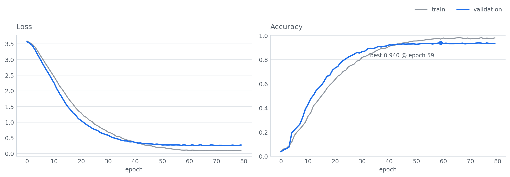
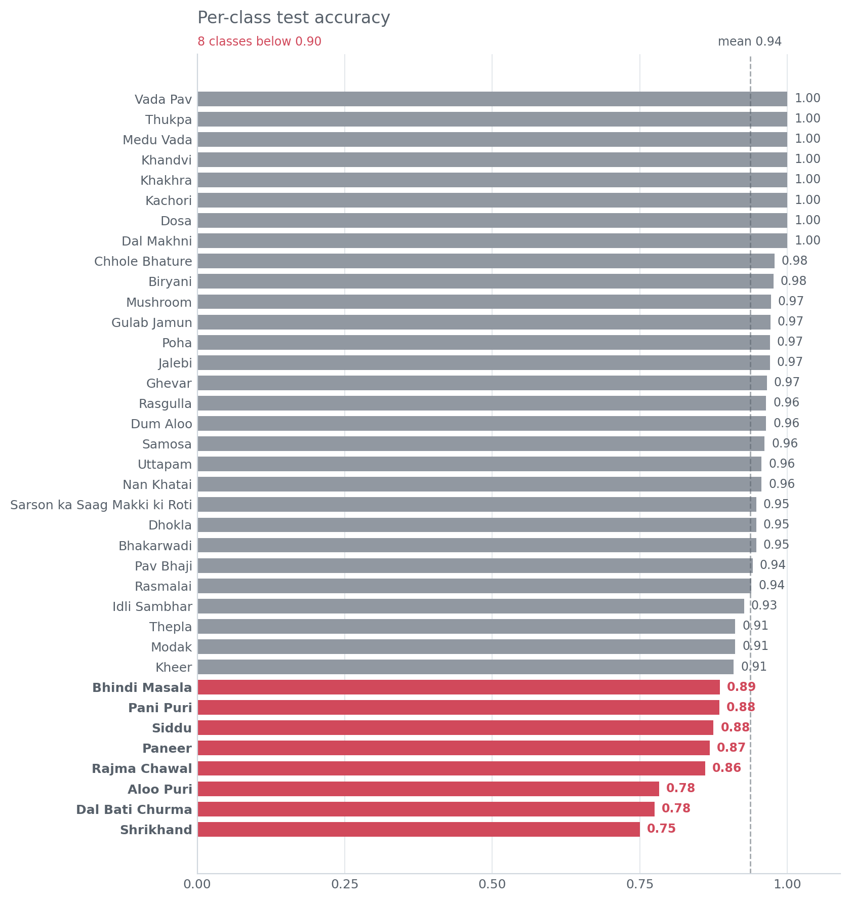

# Indian Food Classifier — ResNet-50

**94% test accuracy** on 37 traditional Indian dishes using a fine-tuned ResNet-50 with video inference support.


---

## Table of Contents
- [Overview](#overview)
- [Dataset](#dataset)
- [Pipeline](#pipeline)
- [Model Architecture](#model-architecture)
- [Training](#training)
- [Results](#results)
- [Inference](#inference)
- [Project Structure](#project-structure)
- [Setup & Usage](#setup--usage)

---

## Overview

This project trains a deep learning classifier to recognise **37 traditional Indian food dishes** from images and video frames. It uses a **ResNet-50** backbone pretrained on ImageNet, fine-tuned end-to-end on the `ind_food_37` dataset. An optional video analysis mode processes a video file frame-by-frame and serves results in a local HTML report.

| Metric | Value |
|---|---|
| Architecture | ResNet-50 (fine-tuned) |
| Trainable Parameters | 39,544,363 |
| Epochs | 80 |
| Batch Size | 16 |
| Test Accuracy | **94%** |
| Macro F1-Score | **0.94** |
| Classes | 37 |

---

## Dataset

**`ind_food_37`** — Indian Food 37 classes dataset structured as an `ImageFolder`:

```
ind_food_37/
├── train/
│   └── <class_name>/  (images)
├── val/
│   └── <class_name>/
└── test/
    └── <class_name>/
```

### Classes (37)
`Aloo Puri` · `Bhakarwadi` · `Bhindi Masala` · `Biryani` · `Chhole Bhature` · `Dal Bati Churma` · `Dal Makhni` · `Dhokla` · `Dosa` · `Dum Aloo` · `Ghevar` · `Gulab Jamun` · `Idli Sambhar` · `Jalebi` · `Kachori` · `Khakhra` · `Khandvi` · `Kheer` · `Medu Vada` · `Modak` · `Mushroom` · `Nan Khatai` · `Paneer` · `Pani Puri` · `Pav Bhaji` · `Poha` · `Rajma Chawal` · `Rasgulla` · `Rasmalai` · `Samosa` · `Sarson ka Saag Makki ki Roti` · `Shrikhand` · `Siddu` · `Thepla` · `Thukpa` · `Uttapam` · `Vada Pav`

---

## Pipeline


| Stage | Details |
|---|---|
| **Input** | RGB images in `ind_food_37/{train,val,test}` |
| **Preprocessing** | Resize to 224x224, ToTensor, Normalize (ImageNet mean/std) |
| **Model** | ResNet-50 pretrained on ImageNet; final FC replaced with Linear(2048 to 37) |
| **Loss** | CrossEntropyLoss |
| **Optimizer** | Adam |
| **Scheduler** | `ReduceLROnPlateau` (val loss) |
| **Grad Clipping** | `clip_grad_norm_` |
| **Checkpointing** | Best model weights saved by val accuracy |
| **Evaluation** | Per-class accuracy, macro F1, confusion matrix |
| **Inference** | Single image or video frame-by-frame |

---

## Model Architecture


ResNet-50 uses stacked **Bottleneck** residual blocks (1x1 to 3x3 to 1x1 convolutions with a skip connection) across 4 stages, followed by Global Average Pooling. The original 1000-class head is replaced with a **Linear(2048 to 37)** layer for this task.

```
Input (224x224x3)
    |-- Conv1: 7x7, 64, stride 2   -->  112x112x64
    |-- MaxPool: 3x3, stride 2     -->   56x56x64
    |-- Layer1: 3x Bottleneck      -->   56x56x256
    |-- Layer2: 4x Bottleneck      -->   28x28x512
    |-- Layer3: 6x Bottleneck      -->   14x14x1024
    |-- Layer4: 3x Bottleneck      -->    7x7x2048
    |-- AdaptiveAvgPool            -->      2048
    |-- FC (2048 -> 37)            -->        37
```

---

## Training



### Hyperparameters
| Parameter | Value |
|---|---|
| Epochs | 80 |
| Batch Size | 16 |
| Optimizer | Adam |
| LR Scheduler | ReduceLROnPlateau |
| Grad Clip Norm | Enabled |
| Input Size | 224 x 224 |
| Normalisation | ImageNet mean/std |

The model was trained on **NVIDIA Tesla T4 GPU** (Kaggle environment).

---

## Results



### Overall Metrics
| Split | Accuracy | Macro Precision | Macro Recall | Macro F1 |
|---|---|---|---|---|
| Test | **94%** | 0.94 | 0.94 | 0.94 |

### Perfect-Accuracy Classes (1.00)
Dal Makhni · Dosa · Kachori · Khakhra · Khandvi · Medu Vada · Thukpa · Vada Pav

### Lowest Accuracy Classes
| Class | Accuracy |
|---|---|
| Shrikhand | 75.0% |
| Dal Bati Churma | 77.5% |
| Aloo Puri | 78.3% |

---

## Inference

### Single Image
```python
from src.predict import predict_image
label, confidence = predict_image("path/to/food.jpg")
print(f"Prediction: {label}  ({confidence*100:.1f}%)")
```

### Video Analysis
The notebook includes a `process_video()` function that:
1. Captures one frame per second from a video file
2. Runs the classifier on each frame
3. Saves frames to `captured_frames/`
4. Generates a browseable `video_results.html` report served on localhost

```python
process_video(
    video_path="my_food_video.mp4",
    output_folder="captured_frames",
    html_path="video_results.html"
)
```

---

## Project Structure

```
indian-food-classifier/
├── resnet_food.ipynb          # Main training notebook
├── src/
│   ├── dataset.py             # Dataset & DataLoader helpers
│   ├── model.py               # Model definition
│   ├── train.py               # Training loop
│   └── predict.py             # Inference utilities
├── assets/
│   ├── pipeline_diagram.png
│   ├── resnet50_architecture.png
│   ├── training_curves.png
│   └── per_class_accuracy.png
├── requirements.txt
└── README.md
```

---

## Setup & Usage

### 1. Clone & Install
```bash
git clone https://github.com/<your-username>/indian-food-classifier.git
cd indian-food-classifier
pip install -r requirements.txt
```

### 2. Prepare Dataset
Place the `ind_food_37` dataset folder (with `train/`, `val/`, `test/` sub-folders) in the project root.

### 3. Train
Open and run `resnet_food.ipynb`, or use the modular scripts:
```bash
python src/train.py --epochs 80 --batch_size 16
```

### 4. Evaluate
```bash
python src/predict.py --mode eval --data_path ind_food_37/test
```

### 5. Run on a Video
```bash
python src/predict.py --mode video --video_path myfood.mp4
```

---

## Requirements

```
torch>=2.0
torchvision>=0.15
opencv-python
scikit-learn
matplotlib
pandas
tqdm
numpy
pillow
```

---

## License
MIT License

---

*Built with PyTorch · ResNet-50 · Kaggle T4 GPU*
